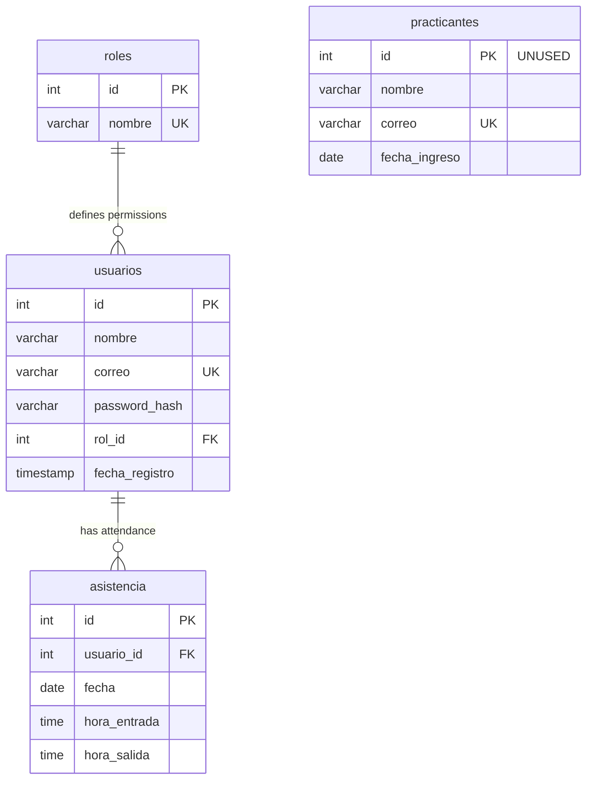

## Database Architecture

The Asistencias system uses a MySQL relational database named `asistencia_practicantes`. The database is designed to track municipal interns (practicantes), their attendance records, and manage user access through a role-based authentication system.

<Warning>
**Schema vs. Implementation**: The `bd.sql` file defines a separate `practicantes` table, but the **actual application code does not use it**. All intern data is stored in the `usuarios` table with `rol_id = 3` (practicante role), and the `asistencia` table uses `usuario_id` to reference users, not `practicante_id`.
</Warning>

### Database Name

```sql
asistencia_practicantes
```

## Schema Structure

The database consists of **4 tables**, but only **3 are actively used** in the application:

<CardGroup cols={2}>
  <Card title="User Management" icon="users">
    - `usuarios` - System users AND interns (`rol_id = 3`)
    - `roles` - User roles and permissions
  </Card>
  
  <Card title="Attendance Tracking" icon="calendar-check">
    - `asistencia` - Attendance records (uses `usuario_id`)
    - `practicantes` - **NOT USED** (defined in schema only)
  </Card>
</CardGroup>

## Key Features

### Relational Integrity

The database enforces referential integrity through foreign key constraints:

- **Attendance records** are linked to specific users (interns) via `usuario_id` foreign key
- **Users** are assigned specific roles that define their permissions
- Interns are identified by having `rol_id = 3` in the `usuarios` table
- Cascading behaviors ensure data consistency

### Data Validation

<AccordionGroup>
  <Accordion title="Unique Constraints">
    - Email addresses must be unique in the `usuarios` table
    - Role names must be unique in the `roles` table
  </Accordion>
  
  <Accordion title="Required Fields">
    - All users (including interns) must have name, email, and password hash
    - Attendance records require user ID (`usuario_id`), date, and entry time
    - Interns must have `rol_id = 3` in the `usuarios` table
  </Accordion>
  
  <Accordion title="Nullable Fields">
    - Exit time (`hora_salida`) in attendance records can be NULL for active sessions
    - User role ID can be NULL (for pending role assignment)
  </Accordion>
</AccordionGroup>

### Auto-Generated Values

- **Primary Keys**: All tables use `AUTO_INCREMENT` for ID generation
- **Timestamps**: User registration timestamps are auto-generated on insert

## Database Relationships (Actual Implementation)



<Note>
The `practicantes` table is defined in `bd.sql` but **not used in the application**. All intern data is in the `usuarios` table.
</Note>

## Default Data

The database includes predefined roles to support the role-based access control system:

| Role ID | Role Name | Purpose |
|---------|-----------|----------|
| 1 | admin | Full system access and configuration |
| 2 | supervisor | Monitor and manage intern attendance |
| 3 | practicante | Self-service attendance tracking |

<Note>
These roles are inserted automatically during database creation and form the foundation of the access control system.
</Note>

## Design Principles

### Normalization

The database follows third normal form (3NF) principles:

- **No redundant data**: Roles are stored once and referenced
- **Atomic values**: Each column contains indivisible data
- **Dependent on key**: All non-key attributes depend on the primary key

### Security

<Warning>
Passwords are stored as hashes (`password_hash` VARCHAR(255)) to support secure hashing algorithms like bcrypt or Argon2.
</Warning>

### Scalability

The schema is designed to scale efficiently:

- Integer primary keys for optimal indexing
- Foreign key indexes for fast JOIN operations
- Minimal table coupling for independent scaling

## Storage Considerations

### Field Sizes

- **Names**: `VARCHAR(100)` - Accommodates full names with accents/special characters
- **Emails**: `VARCHAR(100)` - Standard email length
- **Role Names**: `VARCHAR(50)` - Short role identifiers
- **Password Hashes**: `VARCHAR(255)` - Supports modern hashing algorithms

### Date and Time Handling

- **Dates**: `DATE` type for intern entry dates and attendance dates
- **Times**: `TIME` type for entry/exit times with HH:MM:SS precision
- **Timestamps**: `TIMESTAMP` with automatic current timestamp for audit trails

## Next Steps

<CardGroup cols={2}>
  <Card title="Table Details" icon="table" href="./tables">
    Explore detailed schema for each table
  </Card>
  
  <Card title="Relationships" icon="diagram-project" href="./relationships">
    Understand foreign key relationships and joins
  </Card>
</CardGroup>