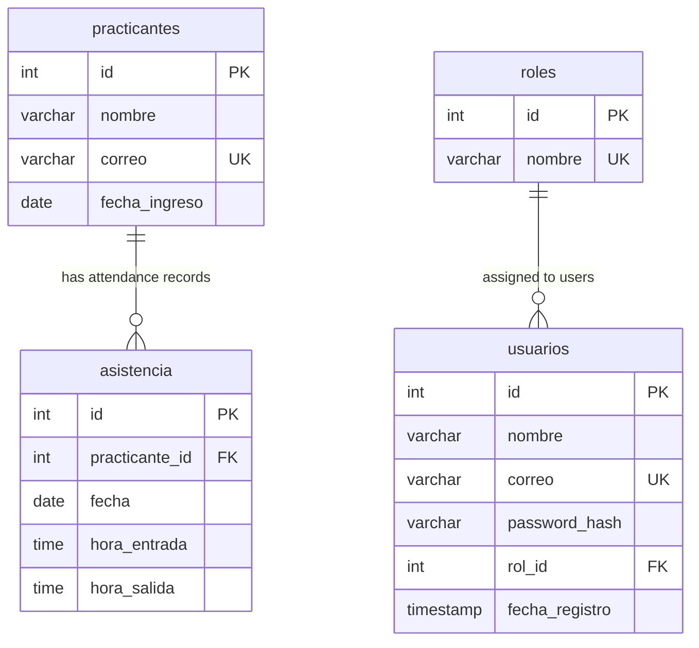

## Relationship Overview

The `asistencia_practicantes` database uses foreign key constraints to maintain referential integrity between tables. This page documents all relationships and provides practical examples of how to query related data.

## Entity Relationship Diagram



---

## Foreign Key Relationships

### 1. asistencia → practicantes

Attendance records are linked to interns through a **many-to-one** relationship.

<AccordionGroup>
  <Accordion title="Relationship Details">
    - **Child Table**: `asistencia`
    - **Parent Table**: `practicantes`
    - **Foreign Key Column**: `practicante_id`
    - **References**: `practicantes(id)`
    - **Cardinality**: Many-to-One (multiple attendance records per intern)
  </Accordion>
  
  <Accordion title="Schema Definition">
    ```sql
    CREATE TABLE asistencia (
        id INT AUTO_INCREMENT PRIMARY KEY,
        practicante_id INT NOT NULL,
        fecha DATE NOT NULL,
        hora_entrada TIME NOT NULL,
        hora_salida TIME NULL,
        FOREIGN KEY (practicante_id) REFERENCES practicantes(id)
    );
    ```
  </Accordion>
  
  <Accordion title="Referential Integrity Rules">
    **INSERT**: Cannot create attendance record for non-existent intern
    ```sql
    -- This will FAIL if practicante_id = 999 doesn't exist
    INSERT INTO asistencia (practicante_id, fecha, hora_entrada)
    VALUES (999, '2024-03-05', '09:00:00');
    ```
    
    **DELETE**: Cannot delete intern with existing attendance records
    ```sql
    -- This will FAIL if intern has attendance records
    DELETE FROM practicantes WHERE id = 1;
    ```
    
    **UPDATE**: Cannot change intern ID to non-existent value
    ```sql
    -- This will FAIL if new practicante_id doesn't exist
    UPDATE asistencia SET practicante_id = 999 WHERE id = 1;
    ```
  </Accordion>
</AccordionGroup>

#### Join Examples

<CodeGroup>
```sql Inner Join
-- Get attendance records with intern names
SELECT 
    p.nombre,
    p.correo,
    a.fecha,
    a.hora_entrada,
    a.hora_salida
FROM asistencia a
INNER JOIN practicantes p ON a.practicante_id = p.id
WHERE a.fecha = '2024-03-05'
ORDER BY a.hora_entrada;
```

```sql Left Join
-- Get all interns and their attendance today (including those absent)
SELECT 
    p.nombre,
    p.correo,
    a.hora_entrada,
    a.hora_salida,
    CASE 
        WHEN a.id IS NULL THEN 'Absent'
        WHEN a.hora_salida IS NULL THEN 'Present'
        ELSE 'Completed'
    END as status
FROM practicantes p
LEFT JOIN asistencia a ON p.id = a.practicante_id 
    AND a.fecha = CURDATE()
ORDER BY p.nombre;
```

```sql Aggregate Query
-- Count attendance records per intern
SELECT 
    p.nombre,
    COUNT(a.id) as total_dias,
    MIN(a.fecha) as primera_asistencia,
    MAX(a.fecha) as ultima_asistencia
FROM practicantes p
LEFT JOIN asistencia a ON p.id = a.practicante_id
GROUP BY p.id, p.nombre
ORDER BY total_dias DESC;
```

```sql Complex Query
-- Get average daily hours worked per intern
SELECT 
    p.nombre,
    COUNT(a.id) as dias_trabajados,
    AVG(
        TIMESTAMPDIFF(MINUTE, a.hora_entrada, a.hora_salida)
    ) / 60 as horas_promedio_diarias
FROM practicantes p
INNER JOIN asistencia a ON p.id = a.practicante_id
WHERE a.hora_salida IS NOT NULL
GROUP BY p.id, p.nombre
HAVING dias_trabajados > 0
ORDER BY horas_promedio_diarias DESC;
```
</CodeGroup>

<Note>
The foreign key constraint ensures that every attendance record is always linked to a valid intern, preventing orphaned records.
</Note>

---

### 2. usuarios → roles

User accounts are linked to roles through a **many-to-one** relationship.

<AccordionGroup>
  <Accordion title="Relationship Details">
    - **Child Table**: `usuarios`
    - **Parent Table**: `roles`
    - **Foreign Key Column**: `rol_id`
    - **References**: `roles(id)`
    - **Cardinality**: Many-to-One (multiple users can have the same role)
    - **Nullable**: Yes (allows users without assigned roles)
  </Accordion>
  
  <Accordion title="Schema Definition">
    ```sql
    CREATE TABLE usuarios (
        id INT AUTO_INCREMENT PRIMARY KEY,
        nombre VARCHAR(100) NOT NULL,
        correo VARCHAR(100) UNIQUE NOT NULL,
        password_hash VARCHAR(255) NOT NULL,
        rol_id INT,
        fecha_registro TIMESTAMP DEFAULT CURRENT_TIMESTAMP,
        FOREIGN KEY (rol_id) REFERENCES roles(id)
    );
    ```
  </Accordion>
  
  <Accordion title="Referential Integrity Rules">
    **INSERT**: Can create user without role (NULL) or with valid role ID
    ```sql
    -- Both are valid
    INSERT INTO usuarios (nombre, correo, password_hash, rol_id)
    VALUES ('Juan Pérez', 'juan@example.com', 'hash123', 1);
    
    INSERT INTO usuarios (nombre, correo, password_hash, rol_id)
    VALUES ('María García', 'maria@example.com', 'hash456', NULL);
    
    -- This will FAIL if rol_id = 999 doesn't exist
    INSERT INTO usuarios (nombre, correo, password_hash, rol_id)
    VALUES ('Error User', 'error@example.com', 'hash789', 999);
    ```
    
    **DELETE**: Cannot delete role with assigned users
    ```sql
    -- This will FAIL if role has users
    DELETE FROM roles WHERE id = 1;
    ```
    
    **UPDATE**: Can assign/remove roles from users
    ```sql
    -- Assign role to user
    UPDATE usuarios SET rol_id = 2 WHERE id = 1;
    
    -- Remove role from user
    UPDATE usuarios SET rol_id = NULL WHERE id = 1;
    ```
  </Accordion>
</AccordionGroup>

#### Join Examples

<CodeGroup>
```sql Inner Join
-- Get users with their role names
SELECT 
    u.id,
    u.nombre,
    u.correo,
    r.nombre as rol,
    u.fecha_registro
FROM usuarios u
INNER JOIN roles r ON u.rol_id = r.id
ORDER BY u.fecha_registro DESC;
```

```sql Left Join
-- Get all users including those without roles
SELECT 
    u.id,
    u.nombre,
    u.correo,
    COALESCE(r.nombre, 'Sin Rol') as rol,
    u.fecha_registro
FROM usuarios u
LEFT JOIN roles r ON u.rol_id = r.id
ORDER BY r.nombre, u.nombre;
```

```sql Filter by Role
-- Get all admin users
SELECT 
    u.nombre,
    u.correo,
    u.fecha_registro
FROM usuarios u
INNER JOIN roles r ON u.rol_id = r.id
WHERE r.nombre = 'admin'
ORDER BY u.fecha_registro;
```

```sql Count Users by Role
-- Distribution of users across roles
SELECT 
    r.nombre as rol,
    COUNT(u.id) as total_usuarios
FROM roles r
LEFT JOIN usuarios u ON r.id = u.rol_id
GROUP BY r.id, r.nombre
ORDER BY total_usuarios DESC;
```
</CodeGroup>

<Note>
The `rol_id` field is nullable, allowing user accounts to be created before role assignment. This is useful for staged user onboarding processes.
</Note>

---

## Common Query Patterns

### Finding Related Records

<AccordionGroup>
  <Accordion title="Get Intern with All Attendance Records">
    ```sql
    SELECT 
        p.nombre,
        p.correo,
        p.fecha_ingreso,
        a.fecha,
        a.hora_entrada,
        a.hora_salida,
        TIMEDIFF(a.hora_salida, a.hora_entrada) as tiempo_trabajado
    FROM practicantes p
    LEFT JOIN asistencia a ON p.id = a.practicante_id
    WHERE p.id = 1
    ORDER BY a.fecha DESC;
    ```
    
    **Use Case**: Display complete attendance history for specific intern
  </Accordion>
  
  <Accordion title="Get All Users with Specific Role">
    ```sql
    SELECT 
        u.id,
        u.nombre,
        u.correo,
        u.fecha_registro
    FROM usuarios u
    INNER JOIN roles r ON u.rol_id = r.id
    WHERE r.nombre = 'supervisor'
    ORDER BY u.nombre;
    ```
    
    **Use Case**: List all supervisors for administrative purposes
  </Accordion>
  
  <Accordion title="Find Interns with No Attendance Today">
    ```sql
    SELECT 
        p.id,
        p.nombre,
        p.correo
    FROM practicantes p
    LEFT JOIN asistencia a ON p.id = a.practicante_id 
        AND a.fecha = CURDATE()
    WHERE a.id IS NULL
    ORDER BY p.nombre;
    ```
    
    **Use Case**: Identify absent interns for follow-up
  </Accordion>
  
  <Accordion title="Get Interns Currently Present">
    ```sql
    SELECT 
        p.nombre,
        a.hora_entrada,
        TIMEDIFF(CURTIME(), a.hora_entrada) as tiempo_presente
    FROM asistencia a
    INNER JOIN practicantes p ON a.practicante_id = p.id
    WHERE a.fecha = CURDATE() 
        AND a.hora_salida IS NULL
    ORDER BY a.hora_entrada;
    ```
    
    **Use Case**: Real-time dashboard of current attendance
  </Accordion>
</AccordionGroup>

### Statistical Queries

<AccordionGroup>
  <Accordion title="Attendance Rate by Intern">
    ```sql
    SELECT 
        p.nombre,
        COUNT(DISTINCT a.fecha) as dias_asistidos,
        DATEDIFF(CURDATE(), p.fecha_ingreso) as dias_desde_ingreso,
        ROUND(
            (COUNT(DISTINCT a.fecha) * 100.0) / 
            NULLIF(DATEDIFF(CURDATE(), p.fecha_ingreso), 0), 
            2
        ) as porcentaje_asistencia
    FROM practicantes p
    LEFT JOIN asistencia a ON p.id = a.practicante_id
    GROUP BY p.id, p.nombre, p.fecha_ingreso
    ORDER BY porcentaje_asistencia DESC;
    ```
    
    **Use Case**: Calculate attendance rate for performance reviews
  </Accordion>
  
  <Accordion title="Average Entry/Exit Times by Intern">
    ```sql
    SELECT 
        p.nombre,
        COUNT(a.id) as total_registros,
        SEC_TO_TIME(AVG(TIME_TO_SEC(a.hora_entrada))) as hora_entrada_promedio,
        SEC_TO_TIME(AVG(TIME_TO_SEC(a.hora_salida))) as hora_salida_promedio
    FROM practicantes p
    INNER JOIN asistencia a ON p.id = a.practicante_id
    WHERE a.hora_salida IS NOT NULL
    GROUP BY p.id, p.nombre
    HAVING total_registros >= 5
    ORDER BY hora_entrada_promedio;
    ```
    
    **Use Case**: Analyze punctuality and work schedule patterns
  </Accordion>
  
  <Accordion title="Monthly Attendance Summary">
    ```sql
    SELECT 
        p.nombre,
        DATE_FORMAT(a.fecha, '%Y-%m') as mes,
        COUNT(a.id) as dias_trabajados,
        SUM(
            TIMESTAMPDIFF(MINUTE, a.hora_entrada, a.hora_salida)
        ) / 60.0 as horas_totales
    FROM practicantes p
    INNER JOIN asistencia a ON p.id = a.practicante_id
    WHERE a.hora_salida IS NOT NULL
    GROUP BY p.id, p.nombre, DATE_FORMAT(a.fecha, '%Y-%m')
    ORDER BY mes DESC, horas_totales DESC;
    ```
    
    **Use Case**: Generate monthly attendance reports
  </Accordion>
</AccordionGroup>

---

## Data Integrity Considerations

### Cascade Operations

<Warning>
**Current Behavior**: The schema does NOT define CASCADE rules for foreign keys.

This means:
- Deleting a `practicante` will FAIL if they have attendance records
- Deleting a `role` will FAIL if it's assigned to any users

To delete parent records, you must first delete or update child records:

```sql
-- To delete an intern, first delete their attendance
DELETE FROM asistencia WHERE practicante_id = 1;
DELETE FROM practicantes WHERE id = 1;

-- To delete a role, first reassign or delete users
UPDATE usuarios SET rol_id = NULL WHERE rol_id = 2;
DELETE FROM roles WHERE id = 2;
```
</Warning>

### Adding CASCADE Behavior (Optional)

If you want automatic deletion of related records, you can modify the foreign keys:

```sql
-- Drop existing foreign key
ALTER TABLE asistencia 
DROP FOREIGN KEY asistencia_ibfk_1;

-- Add foreign key with CASCADE
ALTER TABLE asistencia
ADD CONSTRAINT fk_asistencia_practicante
FOREIGN KEY (practicante_id) 
REFERENCES practicantes(id)
ON DELETE CASCADE
ON UPDATE CASCADE;
```

<Note>
**Exercise caution** when adding CASCADE rules. Accidentally deleting a parent record could remove large amounts of related data.
</Note>

### Orphaned Records Prevention

The foreign key constraints automatically prevent orphaned records:

<CardGroup cols={2}>
  <Card title="Attendance Protection" icon="shield-check">
    Cannot create attendance records for non-existent interns
  </Card>
  
  <Card title="Role Protection" icon="shield-check">
    Cannot assign non-existent roles to users (except NULL)
  </Card>
</CardGroup>

---

## Advanced Relationship Queries

### Multi-Table Joins

```sql
-- Complex query: Get attendance with intern and supervisor info
-- (Assuming there's a supervisor_id in practicantes - not in current schema)
-- This example shows potential extensions

SELECT 
    p.nombre as practicante,
    a.fecha,
    a.hora_entrada,
    a.hora_salida,
    u.nombre as usuario_registrador,
    r.nombre as rol_usuario
FROM asistencia a
INNER JOIN practicantes p ON a.practicante_id = p.id
LEFT JOIN usuarios u ON u.correo = p.correo  -- Assuming email match
LEFT JOIN roles r ON u.rol_id = r.id
WHERE a.fecha BETWEEN '2024-03-01' AND '2024-03-31'
ORDER BY a.fecha DESC, p.nombre;
```

### Subqueries with Relationships

```sql
-- Find interns with above-average attendance
WITH attendance_counts AS (
    SELECT 
        practicante_id,
        COUNT(*) as dias_asistidos
    FROM asistencia
    GROUP BY practicante_id
)
SELECT 
    p.nombre,
    p.correo,
    ac.dias_asistidos
FROM practicantes p
INNER JOIN attendance_counts ac ON p.id = ac.practicante_id
WHERE ac.dias_asistidos > (
    SELECT AVG(dias_asistidos) FROM attendance_counts
)
ORDER BY ac.dias_asistidos DESC;
```

---

## Performance Optimization

### Indexes on Foreign Keys

MySQL automatically creates indexes on foreign key columns, which optimizes JOIN operations:

- `asistencia.practicante_id` - Indexed for fast lookups
- `usuarios.rol_id` - Indexed for fast role-based queries

### Query Optimization Tips

<AccordionGroup>
  <Accordion title="Use EXPLAIN for Query Analysis">
    ```sql
    EXPLAIN SELECT 
        p.nombre,
        COUNT(a.id) as total_asistencias
    FROM practicantes p
    LEFT JOIN asistencia a ON p.id = a.practicante_id
    GROUP BY p.id, p.nombre;
    ```
    
    Check for:
    - Type: Should use `ref` or `eq_ref` for indexed joins
    - Key: Should show index usage
    - Rows: Lower is better
  </Accordion>
  
  <Accordion title="Add Composite Indexes for Common Queries">
    ```sql
    -- Optimize queries filtering by date
    CREATE INDEX idx_asistencia_fecha 
    ON asistencia(fecha);
    
    -- Optimize queries filtering by intern and date
    CREATE INDEX idx_asistencia_practicante_fecha 
    ON asistencia(practicante_id, fecha);
    
    -- Optimize role-based user queries
    CREATE INDEX idx_usuarios_rol 
    ON usuarios(rol_id);
    ```
  </Accordion>
  
  <Accordion title="Avoid N+1 Query Problems">
    **Bad**: Separate query for each intern
    ```sql
    -- Query 1: Get all interns
    SELECT * FROM practicantes;
    
    -- Query 2-N: Get attendance for each intern (in loop)
    SELECT * FROM asistencia WHERE practicante_id = ?;
    ```
    
    **Good**: Single JOIN query
    ```sql
    SELECT 
        p.*,
        a.*
    FROM practicantes p
    LEFT JOIN asistencia a ON p.id = a.practicante_id
    ORDER BY p.id, a.fecha DESC;
    ```
  </Accordion>
</AccordionGroup>

---

## Summary

The database implements a clean relational structure with two primary relationships:

<CardGroup cols={2}>
  <Card title="Attendance Tracking" icon="link">
    **asistencia → practicantes**
    
    Many-to-one relationship linking attendance records to interns
  </Card>
  
  <Card title="User Authorization" icon="link">
    **usuarios → roles**
    
    Many-to-one relationship assigning roles to users
  </Card>
</CardGroup>

### Key Takeaways

- Foreign keys ensure referential integrity
- Relationships enable powerful JOIN queries
- Indexes on foreign keys optimize query performance
- No CASCADE rules means explicit deletion management
- Both relationships follow many-to-one patterns

<Card title="View Table Details" icon="table" href="./tables">
  Explore detailed schema for each table
</Card>