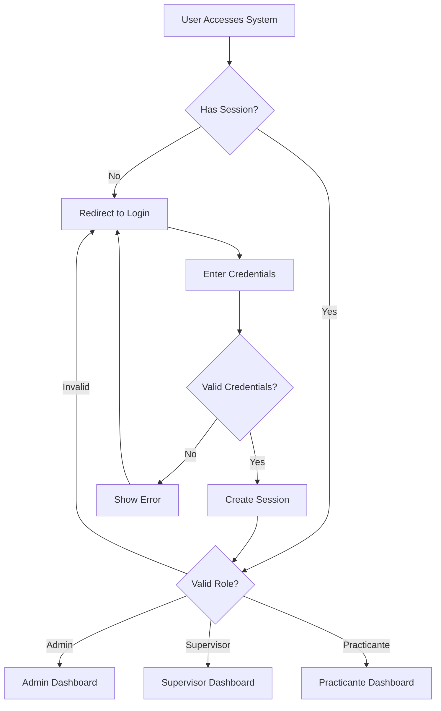

## Overview

Asistencias implements a secure authentication system using PHP sessions, password hashing with bcrypt, and prepared SQL statements to prevent injection attacks. The system supports user registration, login, and role-based access control.

## Authentication Flow



## User Registration

### Registration Form

New users can register through `registra_sesion.php` with the following fields:

<ParamField path="nombre" type="string" required>
  Full name of the user
</ParamField>

<ParamField path="correo" type="email" required>
  Email address (must be unique)
</ParamField>

<ParamField path="password" type="string" required>
  User password (will be hashed)
</ParamField>

<ParamField path="confirm_password" type="string" required>
  Password confirmation (must match password)
</ParamField>

<ParamField path="rol" type="integer" required>
  Role ID (1=Admin, 2=Supervisor, 3=Practicante)
</ParamField>

### Registration Implementation

```php
// registra_sesion.php
if ($_SERVER["REQUEST_METHOD"] == "POST") {
    // Sanitize and validate input
    $nombre = sanitize_input($_POST['nombre']);
    $correo = filter_var($_POST['correo'], FILTER_SANITIZE_EMAIL);
    $password = $_POST['password'];
    $confirm_password = $_POST['confirm_password'];
    $rol = intval($_POST['rol']);

    // Validate email format
    if (!filter_var($correo, FILTER_VALIDATE_EMAIL)) {
        $error = "Formato de correo inválido.";
    } 
    // Check password match
    elseif ($password !== $confirm_password) {
        $error = "Las contraseñas no coinciden.";
    } 
    else {
        // Check if email already exists
        $stmt = $conn->prepare("SELECT id FROM usuarios WHERE correo = ?");
        $stmt->bind_param("s", $correo);
        $stmt->execute();
        $stmt->store_result();

        if ($stmt->num_rows > 0) {
            $error = "El correo ya está registrado.";
        } else {
            // Hash password with bcrypt
            $password_hash = password_hash($password, PASSWORD_BCRYPT);

            // Insert new user
            $stmt = $conn->prepare(
                "INSERT INTO usuarios (nombre, correo, password_hash, rol_id) 
                 VALUES (?, ?, ?, ?)"
            );
            $stmt->bind_param("sssi", $nombre, $correo, $password_hash, $rol);

            if ($stmt->execute()) {
                $success = "Registro exitoso. Puede iniciar sesión.";
            }
        }
    }
}
```

<Note>
  **Input Sanitization**: The system uses a custom `sanitize_input()` function defined in `db.php`:
  ```php
  function sanitize_input($data) {
      $data = trim($data);
      $data = stripslashes($data);
      $data = htmlspecialchars($data);
      return $data;
  }
  ```
</Note>

## Login Process

### Login Form

The login page (`login.php`) accepts two credentials:

```html
<form method="POST" action="">
    <div class="form-group">
        <label>Correo Electrónico:</label>
        <input type="email" name="correo" class="form-control" required>
    </div>
    <div class="form-group">
        <label>Contraseña:</label>
        <input type="password" name="password" class="form-control" required>
    </div>
    <button type="submit" class="btn btn-primary btn-block">Iniciar Sesión</button>
</form>
```

### Login Authentication

<Tabs>
  <Tab title="Step 1: Credential Validation">
    ```php
    // login.php
    if ($_SERVER["REQUEST_METHOD"] == "POST") {
        $correo = sanitize_input($_POST['correo']);
        $password = $_POST['password'];

        // Prepare SQL to prevent SQL injection
        $stmt = $conn->prepare(
            "SELECT id, nombre, password_hash, rol_id 
             FROM usuarios 
             WHERE correo = ?"
        );
        $stmt->bind_param("s", $correo);
        $stmt->execute();
        $result = $stmt->get_result();
    ```
  </Tab>

  <Tab title="Step 2: Password Verification">
    ```php
        if ($result->num_rows === 1) {
            $usuario = $result->fetch_assoc();
            
            // Verify password using bcrypt
            if (password_verify($password, $usuario['password_hash'])) {
                // Password is correct, proceed to session creation
            } else {
                $error = "Contraseña incorrecta.";
            }
        } else {
            $error = "Usuario no encontrado.";
        }
    ```

    <Note>
      `password_verify()` safely compares the plain-text password against the bcrypt hash stored in the database.
    </Note>
  </Tab>

  <Tab title="Step 3: Session Creation">
    ```php
            // Start session and store user data
            $_SESSION['usuario_id'] = $usuario['id'];
            $_SESSION['nombre'] = $usuario['nombre'];
            $_SESSION['rol_id'] = $usuario['rol_id'];

            // Redirect based on role
            switch ($usuario['rol_id']) {
                case 1: // Admin
                    header("Location: dasboards/admin_dashboard.php");
                    break;
                case 2: // Supervisor
                    header("Location: dasboards/supervisor_dashboard.php");
                    break;
                case 3: // Practicante
                    header("Location: dasboards/practicante_dashboard.php");
            }
            exit();
    ```
  </Tab>
</Tabs>

## Session Management

### Session Variables

After successful authentication, the system stores three key session variables:

```php
session_start();
$_SESSION['usuario_id'] = $usuario['id'];     // User's database ID
$_SESSION['nombre'] = $usuario['nombre'];     // User's full name
$_SESSION['rol_id'] = $usuario['rol_id'];     // User's role (1, 2, or 3)
```

### Session Validation

Every protected page validates the session:

<Accordion title="Admin Page Protection">
  ```php
  // admin/asistencias.php
  session_start();
  if (!isset($_SESSION['usuario_id']) || $_SESSION['rol_id'] != 1) {
      header("Location: ../login.php");
      exit();
  }
  ```
</Accordion>

<Accordion title="Supervisor Page Protection">
  ```php
  // dasboards/supervisor_dashboard.php
  session_start();
  if (!isset($_SESSION['usuario_id']) || !in_array($_SESSION['rol_id'], [1, 2])) {
      header("Location: ../login.php");
      exit();
  }
  ```
</Accordion>

<Accordion title="Practicante Page Protection">
  ```php
  // dasboards/practicante_dashboard.php
  session_start();
  if (!isset($_SESSION['usuario_id']) || $_SESSION['rol_id'] != 3) {
      error_log("Intento de acceso no autorizado. User ID: " . 
                ($_SESSION['usuario_id'] ?? 'Not set'));
      header('Location: ../login.php');
      exit;
  }
  ```
</Accordion>

### Logout Implementation

The logout process destroys the session:

```php
// logout.php
session_start();
session_unset();
session_destroy();
header("Location: login.php");
exit();
```

## Security Features

<CardGroup cols={2}>
  <Card title="Password Hashing" icon="hashtag">
    Uses bcrypt (PASSWORD_BCRYPT) for secure password storage with automatic salt generation
  </Card>
  <Card title="SQL Injection Prevention" icon="shield">
    All database queries use prepared statements with parameter binding
  </Card>
  <Card title="Input Sanitization" icon="broom">
    Custom sanitize_input() function removes malicious code from user input
  </Card>
  <Card title="Session Security" icon="key">
    Server-side session validation on every protected page
  </Card>
</CardGroup>

### SQL Injection Prevention

<Tabs>
  <Tab title="Prepared Statements">
    All queries use prepared statements:

    ```php
    // SECURE: Using prepared statement
    $stmt = $conn->prepare("SELECT * FROM usuarios WHERE correo = ?");
    $stmt->bind_param("s", $correo);
    $stmt->execute();
    $result = $stmt->get_result();
    ```

    <Warning>
      Some legacy code still uses direct interpolation and should be refactored:
      ```php
      // INSECURE: Direct interpolation (found in dashboards)
      $query = "SELECT * FROM usuarios WHERE id = '$usuario_id'";
      ```
    </Warning>
  </Tab>

  <Tab title="Parameter Binding">
    The system uses typed parameter binding:

    ```php
    // String parameter
    $stmt->bind_param("s", $correo);

    // Integer parameter
    $stmt->bind_param("i", $usuario_id);

    // Multiple parameters
    $stmt->bind_param("sssi", $nombre, $correo, $password_hash, $rol);
    ```

    Parameter types:
    - `s` - String
    - `i` - Integer
    - `d` - Double
    - `b` - Blob
  </Tab>
</Tabs>

### Password Security

<Accordion title="Password Hashing Process">
  ```php
  // During registration/user creation
  $password_hash = password_hash($password, PASSWORD_BCRYPT);

  // During login
  if (password_verify($password, $usuario['password_hash'])) {
      // Password is correct
  }
  ```

  **Benefits of bcrypt:**
  - Automatic salt generation
  - Configurable computational cost
  - Resistant to rainbow table attacks
  - Future-proof with cost parameter
</Accordion>

<Accordion title="Email Validation">
  ```php
  // Sanitize email
  $correo = filter_var($_POST['correo'], FILTER_SANITIZE_EMAIL);

  // Validate email format
  if (!filter_var($correo, FILTER_VALIDATE_EMAIL)) {
      $error = "Formato de correo inválido.";
  }

  // Check uniqueness
  $stmt = $conn->prepare("SELECT id FROM usuarios WHERE correo = ?");
  $stmt->bind_param("s", $correo);
  $stmt->execute();
  $stmt->store_result();

  if ($stmt->num_rows > 0) {
      $error = "El correo ya está registrado.";
  }
  ```
</Accordion>

## Error Handling

The authentication system provides user-friendly error messages:

### Login Errors

```php
// User not found
if ($result->num_rows !== 1) {
    $error = "Usuario no encontrado.";
}

// Incorrect password
if (!password_verify($password, $usuario['password_hash'])) {
    $error = "Contraseña incorrecta.";
}

// Display error in form
if (!empty($error)) {
    echo "<div class='alert alert-danger'>$error</div>";
}
```

### Registration Errors

```php
// Empty fields
if (empty($nombre) || empty($correo) || empty($password)) {
    $error = "Por favor, complete todos los campos.";
}

// Invalid email
if (!filter_var($correo, FILTER_VALIDATE_EMAIL)) {
    $error = "Formato de correo inválido.";
}

// Password mismatch
if ($password !== $confirm_password) {
    $error = "Las contraseñas no coinciden.";
}

// Duplicate email
if ($stmt->num_rows > 0) {
    $error = "El correo ya está registrado.";
}
```

## Database Configuration

Database connection is managed in `db.php`:

```php
// db.php
$host = "localhost";
$user = "root";
$password = "";
$db = "asistencia_practicantes";

$conn = new mysqli($host, $user, $password, $db);

if ($conn->connect_error) {
    die("Connection failed: " . $conn->connect_error);
}

$conn->set_charset("utf8mb4");
```

<Warning>
  **Production Considerations:**
  - Store database credentials in environment variables
  - Use non-root database user with minimal privileges
  - Enable SSL/TLS for database connections
  - Implement connection pooling for better performance
</Warning>

## Best Practices

1. **Always start sessions** at the beginning of protected pages
   ```php
   session_start();
   ```

2. **Validate both authentication and authorization**
   ```php
   if (!isset($_SESSION['usuario_id']) || $_SESSION['rol_id'] != 1) {
       header("Location: ../login.php");
       exit();
   }
   ```

3. **Use prepared statements** for all database queries
   ```php
   $stmt = $conn->prepare("SELECT * FROM usuarios WHERE id = ?");
   $stmt->bind_param("i", $id);
   ```

4. **Hash passwords** with bcrypt
   ```php
   $password_hash = password_hash($password, PASSWORD_BCRYPT);
   ```

5. **Sanitize all user input**
   ```php
   $nombre = sanitize_input($_POST['nombre']);
   ```

6. **Redirect after authentication** using `exit()`
   ```php
   header("Location: dashboard.php");
   exit();
   ```
