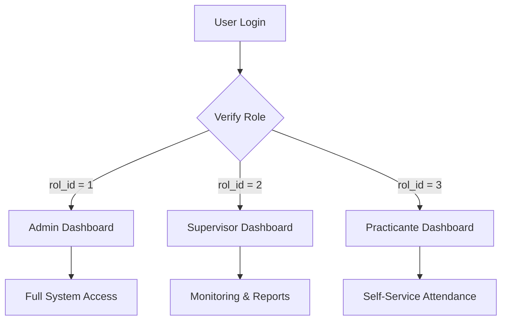

## Overview

Asistencias provides three distinct dashboard interfaces tailored to each user role. Each dashboard displays relevant statistics, navigation options, and role-specific functionality.

## Dashboard Architecture



## Admin Dashboard

**Location**: `dasboards/admin_dashboard.php`

### Access Control

```php
session_start();  
include '../db.php';

// Verify authentication and admin role
if (!isset($_SESSION['usuario_id']) || $_SESSION['rol_id'] != 1) {     
    header("Location: ../login.php");     
    exit(); 
}
```

### Dashboard Statistics

The admin dashboard displays three primary metrics:

<CardGroup cols={3}>
  <Card title="Usuarios Registrados" icon="users" color="#2196F3">
    Total count of all users in the system
  </Card>
  <Card title="Practicantes" icon="user-graduate" color="#4CAF50">
    Users with rol_id = 3 (practicante role)
  </Card>
  <Card title="Asistencias Hoy" icon="calendar-check" color="#17A2B8">
    Attendance records for current date
  </Card>
</CardGroup>

### Statistics Implementation

<Tabs>
  <Tab title="Total Users">
    ```php
    <div class="col-md-4">
        <div class="card text-white bg-primary mb-3">
            <div class="card-header">
                <a href="../admin/usuarios.php" class="btn-primary">
                    Usuarios Registrados
                </a>
            </div>
            <div class="card-body">
                <?php
                require_once '../db.php';
                $result = $conn->query("SELECT COUNT(*) as total FROM usuarios");
                $row = $result->fetch_assoc();
                echo "<h5 class='card-title'>" . $row['total'] . " Usuarios</h5>";
                ?>
            </div>
        </div>
    </div>
    ```
  </Tab>

  <Tab title="Practicantes Count">
    ```php
    <div class="col-md-4">
        <div class="card text-white bg-success mb-3">
            <div class="card-header">
                <a href="../admin/practicantes.php" class="btn-success">
                    Practicantes
                </a>
            </div>
            <div class="card-body">
                <?php
                $result = $conn->query(
                    "SELECT COUNT(*) as total 
                     FROM usuarios 
                     WHERE rol_id = 3"
                );
                $row = $result->fetch_assoc();
                echo "<h5 class='card-title'>" . $row['total'] . " Practicantes</h5>";
                ?>
            </div>
        </div>
    </div>
    ```
  </Tab>

  <Tab title="Today's Attendance">
    ```php
    <div class="col-md-4">
        <div class="card text-white bg-info mb-3">
            <div class="card-header">
                <a href="../admin/asistencias.php" class="btn-info">
                    Asistencias Hoy
                </a>
            </div>
            <div class="card-body">
                <?php
                $result = $conn->query(
                    "SELECT COUNT(*) as total 
                     FROM asistencia 
                     WHERE fecha = CURDATE()"
                );
                $row = $result->fetch_assoc();
                echo "<h5 class='card-title'>" . $row['total'] . " Registros</h5>";
                ?>
            </div>
        </div>
    </div>
    ```
  </Tab>
</Tabs>

### Admin Navigation Menu

```php
<nav class="col-md-2 d-none d-md-block bg-light sidebar">
    <div class="sidebar-sticky">
        <ul class="nav flex-column">
            <li class="nav-item">
                <a class="nav-link active" href="#">
                    <i class="fas fa-tachometer-alt mr-2"></i>
                    Panel de Administración
                </a>
            </li>
            <li class="nav-item">
                <a class="nav-link" href="../admin/usuarios.php">
                    <i class="fas fa-users mr-2"></i>
                    Gestión de Usuarios
                </a>
            </li>
            <li class="nav-item">
                <a class="nav-link" href="../admin/practicantes.php">
                    <i class="fas fa-user-graduate mr-2"></i>
                    Practicantes
                </a>
            </li>
            <li class="nav-item">
                <a class="nav-link" href="../admin/perfil.php">
                    <i class="fas fa-user"></i>
                    Perfil
                </a>
            </li>
            <li class="nav-item">
                <a class="nav-link" href="../admin/asistencias.php">
                    <i class="fas fa-calendar-check mr-2"></i>
                    Asistencias
                </a>
            </li>
            <li class="nav-item">
                <a class="nav-link text-danger" href="../logout.php">
                    <i class="fas fa-sign-out-alt mr-2"></i>
                    Cerrar Sesión
                </a>
            </li>
        </ul>
    </div>
</nav>
```

### Admin Features

<Accordion title="User Management">
  Access through **Gestión de Usuarios**:
  - View all registered users
  - Create new users with role assignment
  - Edit user information
  - Delete users
  - View user roles and email addresses

  Implementation: `admin/usuarios.php`
</Accordion>

<Accordion title="Practicante Management">
  Access through **Practicantes**:
  - View all practicante users (rol_id = 3)
  - Monitor practicante activities
  - Manage practicante-specific data

  Implementation: `admin/practicantes.php`
</Accordion>

<Accordion title="Attendance Management">
  Access through **Asistencias**:
  - View all attendance records
  - Export attendance to Excel
  - Monitor attendance status (Completada/Incompleta)
  - Filter and search attendance data

  Implementation: `admin/asistencias.php`
</Accordion>

## Supervisor Dashboard

**Location**: `dasboards/supervisor_dashboard.php`

### Access Control

```php
session_start();

// Verify authentication and supervisor/admin role
if (!isset($_SESSION['usuario_id']) || !in_array($_SESSION['rol_id'], [1, 2])) {
    header("Location: ../login.php");
    exit();
}
```

<Note>
  Supervisors and admins can both access the supervisor dashboard. This allows admins to view the supervisor interface for testing or support purposes.
</Note>

### Dashboard Statistics

<CardGroup cols={2}>
  <Card title="Practicantes Activos" icon="users" color="#2196F3">
    Total count from practicantes table
  </Card>
  <Card title="Asistencias Hoy" icon="calendar-day" color="#4CAF50">
    Today's attendance record count
  </Card>
</CardGroup>

### Statistics Implementation

<Tabs>
  <Tab title="Active Practicantes">
    ```php
    <div class="col-md-4">
        <div class="card text-white bg-primary mb-3">
            <div class="card-header">
                <a href="../supervisor/usuarios.php" class="btn btn-primary">
                    Practicantes Activos
                </a>
            </div>
            <div class="card-body">
                <?php
                $result = $conn->query(
                    "SELECT COUNT(*) as total FROM practicantes"
                );
                $row = $result->fetch_assoc();
                echo "<h5 class='card-title'>" . $row['total'] . " Practicantes</h5>";
                ?>
            </div>
        </div>
    </div>
    ```
  </Tab>

  <Tab title="Today's Attendance">
    ```php
    <div class="col-md-4">
        <div class="card text-white bg-success mb-3">
            <div class="card-header">
                <a href="../supervisor/lista_asistencias.php" class="btn btn-success">
                    Asistencias Hoy
                </a>
            </div>
            <div class="card-body">
                <?php
                $result = $conn->query(
                    "SELECT COUNT(*) as total 
                     FROM asistencia 
                     WHERE fecha = CURDATE()"
                );
                $row = $result->fetch_assoc();
                echo "<h5 class='card-title'>" . $row['total'] . " Registros</h5>";
                ?>
            </div>
        </div>
    </div>
    ```
  </Tab>
</Tabs>

### Supervisor Navigation Menu

```php
<nav class="col-md-2 d-none d-md-block bg-light sidebar">
    <div class="sidebar-sticky">
        <ul class="nav flex-column">
            <li class="nav-item">
                <a class="nav-link active" href="#">
                    <i class="fas fa-tachometer-alt mr-2"></i>
                    Panel de Supervisor
                </a>
            </li>
            <li class="nav-item">
                <a class="nav-link" href="../supervisor/usuarios.php">
                    <i class="fas fa-users mr-2"></i>
                    Gestión de Usuarios
                </a>
            </li>
            <li class="nav-item">
                <a class="nav-link" href="../supervisor/lista_asistencias.php">
                    <i class="fas fa-calendar-check mr-2"></i>
                    Asistencias
                </a>
            </li>
            <li class="nav-item">
                <a class="nav-link text-danger" href="../logout.php">
                    <i class="fas fa-sign-out-alt mr-2"></i>
                    Cerrar Sesión
                </a>
            </li>
        </ul>
    </div>
</nav>
```

### Supervisor Features

<Accordion title="View User List">
  Read-only access to user information:
  - View practicante details
  - Check user status
  - No create/edit/delete permissions

  Implementation: `supervisor/usuarios.php`
</Accordion>

<Accordion title="Attendance Monitoring">
  View all attendance records:
  - Filter by date
  - View attendance status
  - Monitor practicante check-ins
  - No ability to modify records

  Implementation: `supervisor/lista_asistencias.php`
</Accordion>

## Practicante Dashboard

**Location**: `dasboards/practicante_dashboard.php`

### Access Control

```php
session_start();
require_once '../db.php';

// Validate session and user role
if (!isset($_SESSION['usuario_id']) || $_SESSION['rol_id'] != 3) {
    error_log("Intento de acceso no autorizado. User ID: " . 
              ($_SESSION['usuario_id'] ?? 'Not set') . 
              ", Role ID: " . 
              ($_SESSION['rol_id'] ?? 'Not set'));
    header('Location: ../login.php');
    exit;
}
```

<Note>
  The practicante dashboard includes error logging for unauthorized access attempts, providing an audit trail for security monitoring.
</Note>

### Dashboard Features

The practicante dashboard is focused on self-service attendance management:

<Tabs>
  <Tab title="Check-In/Out Interface">
    ```php
    <h1 class="text-center">Bienvenido, <?php echo $practicante['nombre']; ?></h1>

    <?php if (!$asistencia) { ?>
        <!-- No attendance record for today -->
        <form action="" method="post">
            <button type="submit" name="marcar_entrada" 
                    class="btn btn-primary btn-block">
                Marcar Entrada
            </button>
        </form>
    <?php } else { ?>
        <!-- Attendance record exists -->
        <form action="" method="post">
            <button type="submit" name="marcar_salida" 
                    class="btn btn-primary btn-block">
                Marcar Salida
            </button>
        </form>
    <?php } ?>
    ```
  </Tab>

  <Tab title="Attendance Check">
    ```php
    // Check if attendance exists for today
    $usuario_id = $_SESSION['usuario_id'];
    $query = "SELECT * FROM asistencia 
              WHERE usuario_id = '$usuario_id' 
              AND fecha = DATE(NOW())";
    $result = mysqli_query($conn, $query);
    $asistencia = mysqli_fetch_assoc($result);
    ```
  </Tab>

  <Tab title="Mark Entry">
    ```php
    if (isset($_POST['marcar_entrada'])) {
        $query = "INSERT INTO asistencia 
                  (usuario_id, fecha, hora_entrada, hora_salida) 
                  VALUES ('$usuario_id', DATE(NOW()), TIME(NOW()), NULL)";
        mysqli_query($conn, $query);
        header('Location: practicante_dashboard.php');
        exit;
    }
    ```
  </Tab>

  <Tab title="Mark Exit">
    ```php
    if (isset($_POST['marcar_salida'])) {
        $query = "UPDATE asistencia 
                  SET hora_salida = TIME(NOW()) 
                  WHERE usuario_id = '$usuario_id' 
                  AND fecha = DATE(NOW())";
        mysqli_query($conn, $query);
        header('Location: practicante_dashboard.php');
        exit;
    }
    ```
  </Tab>
</Tabs>

### Attendance History Table

```php
<h2 class="text-center">Asistencia</h2>
<table class="table table-striped">
    <thead>
        <tr>
            <th>Fecha</th>
            <th>Hora Entrada</th>
            <th>Hora Salida</th>
        </tr>
    </thead>
    <tbody>
        <?php
        $query = "SELECT * FROM asistencia WHERE usuario_id = '$usuario_id'";
        $result = mysqli_query($conn, $query);
        while ($asistencia_registro = mysqli_fetch_assoc($result)) {
            echo "<tr>
                    <td>{$asistencia_registro['fecha']}</td>
                    <td>{$asistencia_registro['hora_entrada']}</td>
                    <td>{$asistencia_registro['hora_salida']}</td>
                  </tr>";
        }
        ?>
    </tbody>
</table>
```

### Practicante Navigation Menu

```php
<div class="sidebar">
    <h4 class="text-center">Menú</h4>
    <a href="#">
        <i class="fas fa-home"></i> Inicio
    </a>
    <a href="../practicantes/perfil.php">
        <i class="fas fa-user"></i> Perfil
    </a>
    <a href="../logout.php">
        <i class="fas fa-sign-out-alt"></i> Cerrar Sesión
    </a>
</div>
```

## UI Framework & Styling

All dashboards use Bootstrap 4.5.2 and Font Awesome 5.15.3:

```html
<head>
    <meta charset="UTF-8">
    <title>Panel de [Role]</title>
    <link rel="stylesheet" 
          href="https://stackpath.bootstrapcdn.com/bootstrap/4.5.2/css/bootstrap.min.css">
    <link rel="stylesheet" 
          href="https://cdnjs.cloudflare.com/ajax/libs/font-awesome/5.15.3/css/all.min.css">
</head>
```

### Layout Structure

<Accordion title="Bootstrap Grid Layout">
  ```html
  <div class="container-fluid">
      <div class="row">
          <!-- Sidebar (col-md-2) -->
          <nav class="col-md-2 d-none d-md-block bg-light sidebar">
              <!-- Navigation menu -->
          </nav>

          <!-- Main Content (col-md-9 ml-sm-auto col-lg-10) -->
          <main role="main" class="col-md-9 ml-sm-auto col-lg-10 px-4">
              <!-- Dashboard header -->
              <div class="d-flex justify-content-between ...">
                  <h1 class="h2">Panel Title</h1>
                  <h3>Bienvenido, <?php echo $usuario['nombre']; ?></h3>
              </div>

              <!-- Statistics cards -->
              <div class="row">
                  <!-- Card components -->
              </div>
          </main>
      </div>
  </div>
  ```
</Accordion>

<Accordion title="Card Components">
  ```html
  <div class="col-md-4">
      <div class="card text-white bg-primary mb-3">
          <div class="card-header">
              <a href="link.php" class="btn-primary">Card Title</a>
          </div>
          <div class="card-body">
              <h5 class="card-title">Statistic Value</h5>
          </div>
      </div>
  </div>
  ```

  **Color Classes Used:**
  - `bg-primary` - Blue (#2196F3)
  - `bg-success` - Green (#4CAF50)
  - `bg-info` - Light Blue (#17A2B8)
</Accordion>

## Dashboard Comparison

| Feature | Admin | Supervisor | Practicante |
|---------|-------|------------|-------------|
| User Management | Full CRUD | Read-only | None |
| Attendance Viewing | All records | All records | Own records |
| Attendance Export | Yes | No | No |
| Statistics Cards | 3 | 2 | 0 |
| Navigation Items | 6 | 4 | 3 |
| Mark Attendance | No | No | Yes |
| Edit Attendance | No | No | No |

## Common Dashboard Queries

### Count Today's Attendance

```php
$result = $conn->query(
    "SELECT COUNT(*) as total 
     FROM asistencia 
     WHERE fecha = CURDATE()"
);
$row = $result->fetch_assoc();
```

### Count Users by Role

```php
// All users
$result = $conn->query("SELECT COUNT(*) as total FROM usuarios");

// Practicantes only
$result = $conn->query(
    "SELECT COUNT(*) as total FROM usuarios WHERE rol_id = 3"
);
```

### Get User Information

```php
$usuario_id = $_SESSION['usuario_id'];
$query = "SELECT * FROM usuarios WHERE id = '$usuario_id'";
$result = mysqli_query($conn, $query);
$usuario = mysqli_fetch_assoc($result);
```

<Warning>
  **Security Note**: Some dashboard queries use string interpolation instead of prepared statements. Consider refactoring to use parameterized queries:
  
  ```php
  // Better approach
  $stmt = $conn->prepare("SELECT * FROM usuarios WHERE id = ?");
  $stmt->bind_param("i", $usuario_id);
  $stmt->execute();
  $result = $stmt->get_result();
  ```
</Warning>
