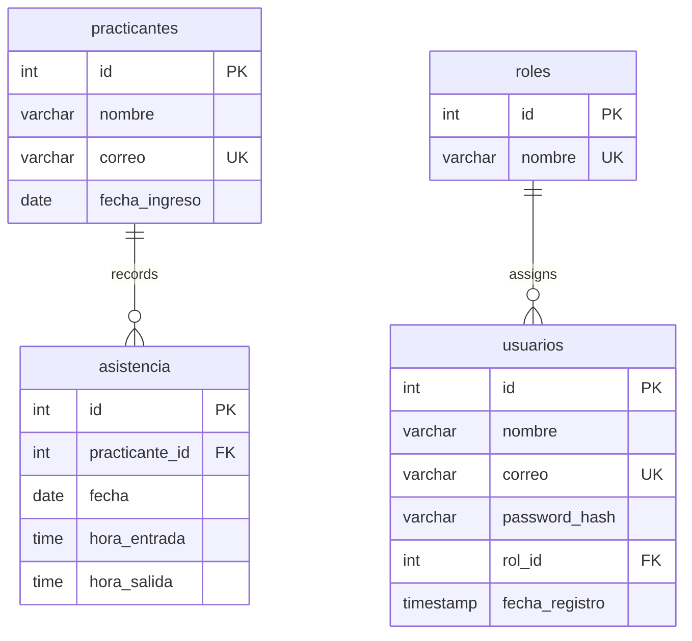

## Overview

The Asistencias system uses MySQL to store attendance records, user information, and role-based access control data. This guide walks you through the complete database setup process.

## Database Schema

The system uses a relational database structure with four main tables:

- **practicantes**: Stores intern information
- **asistencia**: Records attendance check-ins and check-outs
- **roles**: Defines user role types
- **usuarios**: Manages user accounts with authentication

## Installation Steps

<Steps>
  <Step title="Create the Database">
    First, create the main database for the application:

    ```sql
    CREATE DATABASE asistencia_practicantes;
    USE asistencia_practicantes;
    ```

    <Info>
      The database name `asistencia_practicantes` is used throughout the application configuration. If you change it, make sure to update `db.php` accordingly.
    </Info>
  </Step>

  <Step title="Create the Practicantes Table">
    This table stores information about municipal interns:

    ```sql
    CREATE TABLE practicantes (
        id INT AUTO_INCREMENT PRIMARY KEY,
        nombre VARCHAR(100) NOT NULL,
        correo VARCHAR(100) NOT NULL UNIQUE,
        fecha_ingreso DATE NOT NULL
    );
    ```

    **Field descriptions:**
    - `id`: Auto-incrementing primary key
    - `nombre`: Full name of the intern (max 100 characters)
    - `correo`: Email address (must be unique)
    - `fecha_ingreso`: Date when the intern started
  </Step>

  <Step title="Create the Asistencia Table">
    This table records daily attendance with clock-in and clock-out times:

    ```sql
    CREATE TABLE asistencia (
        id INT AUTO_INCREMENT PRIMARY KEY,
        practicante_id INT NOT NULL,
        fecha DATE NOT NULL,
        hora_entrada TIME NOT NULL,
        hora_salida TIME NULL,
        FOREIGN KEY (practicante_id) REFERENCES practicantes(id)
    );
    ```

    **Field descriptions:**
    - `id`: Auto-incrementing primary key
    - `practicante_id`: Foreign key linking to the practicantes table
    - `fecha`: Date of attendance record
    - `hora_entrada`: Check-in time (required)
    - `hora_salida`: Check-out time (nullable until user clocks out)

    <Warning>
      The `hora_salida` field is nullable because users check in before checking out. Your application logic should handle NULL values when users haven't clocked out yet.
    </Warning>
  </Step>

  <Step title="Create the Roles Table">
    Define the three role types used in the system:

    ```sql
    CREATE TABLE roles (
        id INT AUTO_INCREMENT PRIMARY KEY,
        nombre VARCHAR(50) UNIQUE NOT NULL
    );

    INSERT INTO roles (nombre) VALUES 
        ('admin'),
        ('supervisor'),
        ('practicante');
    ```

    **Role definitions:**
    - **admin** (id: 1): Full system access, user management
    - **supervisor** (id: 2): View and manage intern attendance
    - **practicante** (id: 3): Clock in/out and view own attendance
  </Step>

  <Step title="Create the Usuarios Table">
    This table manages user authentication and authorization:

    ```sql
    CREATE TABLE usuarios (
        id INT AUTO_INCREMENT PRIMARY KEY,
        nombre VARCHAR(100) NOT NULL,
        correo VARCHAR(100) UNIQUE NOT NULL,
        password_hash VARCHAR(255) NOT NULL,
        rol_id INT,
        fecha_registro TIMESTAMP DEFAULT CURRENT_TIMESTAMP,
        FOREIGN KEY (rol_id) REFERENCES roles(id)
    );
    ```

    **Field descriptions:**
    - `id`: Auto-incrementing primary key
    - `nombre`: Full name of the user
    - `correo`: Email address (must be unique, used for login)
    - `password_hash`: Bcrypt-hashed password (never store plain text)
    - `rol_id`: Foreign key linking to roles table
    - `fecha_registro`: Automatic timestamp when user registers

    <Note>
      The `password_hash` field is 255 characters to accommodate bcrypt hashes. The application uses `PASSWORD_BCRYPT` algorithm for secure password storage.
    </Note>
  </Step>
</Steps>

## Complete Setup Script

You can run the entire schema creation using the provided SQL file:

```bash
mysql -u root -p < bd.sql
```

Or execute the complete script manually:

<CodeGroup>
```sql bd.sql
CREATE DATABASE asistencia_practicantes;

USE asistencia_practicantes;

CREATE TABLE practicantes (
    id INT AUTO_INCREMENT PRIMARY KEY,
    nombre VARCHAR(100) NOT NULL,
    correo VARCHAR(100) NOT NULL UNIQUE,
    fecha_ingreso DATE NOT NULL
);

CREATE TABLE asistencia (
    id INT AUTO_INCREMENT PRIMARY KEY,
    practicante_id INT NOT NULL,
    fecha DATE NOT NULL,
    hora_entrada TIME NOT NULL,
    hora_salida TIME NULL,
    FOREIGN KEY (practicante_id) REFERENCES practicantes(id)
);

CREATE TABLE roles (
    id INT AUTO_INCREMENT PRIMARY KEY,
    nombre VARCHAR(50) UNIQUE NOT NULL
);

INSERT INTO roles (nombre) VALUES 
    ('admin'),
    ('supervisor'),
    ('practicante');

CREATE TABLE usuarios (
    id INT AUTO_INCREMENT PRIMARY KEY,
    nombre VARCHAR(100) NOT NULL,
    correo VARCHAR(100) UNIQUE NOT NULL,
    password_hash VARCHAR(255) NOT NULL,
    rol_id INT,
    fecha_registro TIMESTAMP DEFAULT CURRENT_TIMESTAMP,
    FOREIGN KEY (rol_id) REFERENCES roles(id)
);
```
</CodeGroup>

## Database Relationships

The schema implements the following foreign key relationships:



## Verification

After setup, verify the database structure:

```sql
-- Check all tables were created
SHOW TABLES;

-- Verify roles were inserted
SELECT * FROM roles;

-- Check table structure
DESCRIBE usuarios;
DESCRIBE practicantes;
DESCRIBE asistencia;
```

Expected output from `SHOW TABLES`:
```
+----------------------------------+
| Tables_in_asistencia_practicantes |
+----------------------------------+
| asistencia                       |
| practicantes                     |
| roles                            |
| usuarios                         |
+----------------------------------+
```

## Character Encoding

<Note>
  The application sets UTF-8 character encoding (`utf8mb4`) for proper handling of special characters. This is configured in `db.php` after connection.
</Note>

## Next Steps

After completing the database setup:

1. Configure database connection parameters in `db.php`
2. Create your first admin user
3. Review security best practices

<Info>
  See the [Configuration Guide](/guides/configuration) for database connection setup and the [Security Guide](/guides/security) for production deployment best practices.
</Info>
